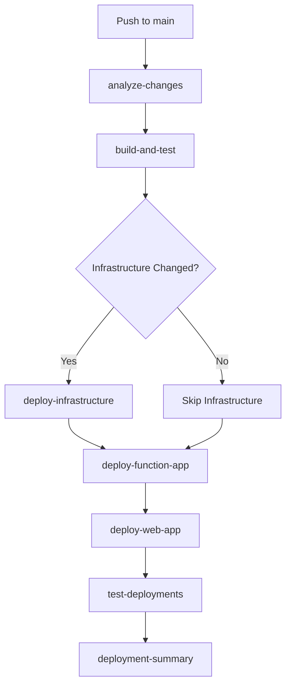

# CI/CD Implementation Summary

This document summarizes the CI/CD setup implementation for the MemberPropertyMarketAlert project, adapted from the CallAssistant project's proven deployment patterns.

## 🎯 Implementation Overview

The CI/CD pipeline has been successfully configured with the following components:

### ✅ Completed Components

1. **GitHub Actions Workflow** (`/.github/workflows/member-property-alert-cd.yml`)
   - Comprehensive deployment pipeline
   - Change detection for optimized deployments
   - Environment-specific deployments (dev, test, prod)
   - Build, test, and deployment automation
   - Health checks and validation

2. **Environment Parameter Files**
   - `/infra/main.dev.parameters.json`
   - `/infra/main.test.parameters.json`
   - `/infra/main.prod.parameters.json`

3. **Deployment Scripts**
   - `/scripts/Deploy-Infrastructure.ps1` - PowerShell deployment script
   - `/scripts/README.md` - Comprehensive script documentation

4. **Documentation**
   - `/docs/CICD_SETUP.md` - Complete setup and configuration guide
   - `/docs/CICD_IMPLEMENTATION_SUMMARY.md` - This summary document

## 🏗️ Architecture Comparison

| Aspect | CallAssistant | MemberPropertyMarketAlert |
|--------|---------------|---------------------------|
| **Deployment Platform** | GitHub Actions | ✅ GitHub Actions |
| **Authentication** | Azure OIDC | ✅ Azure OIDC |
| **Infrastructure** | Multi-business Bicep | ✅ Single-app Bicep |
| **Application Type** | App Services | ✅ Functions + Web App |
| **Change Detection** | Path-based triggers | ✅ Path-based triggers |
| **Environment Support** | Multi-environment | ✅ dev/test/prod |
| **Health Checks** | Comprehensive | ✅ Comprehensive |
| **Error Handling** | Robust | ✅ Robust |

## 🔧 Key Adaptations Made

### 1. **Application Architecture Adaptation**
- **From:** App Services with WebSocket support
- **To:** Azure Functions + Web App architecture
- **Changes:** Modified deployment jobs for Function App and Web App separately

### 2. **Build Process Adaptation**
- **From:** Multi-business solution builds
- **To:** Single solution with Function App and React UI
- **Changes:** Simplified build matrix, added React build process

### 3. **Infrastructure Deployment**
- **From:** Multi-business conditional deployments
- **To:** Single application deployment with environment variations
- **Changes:** Simplified parameter handling, single Bicep template

### 4. **Resource Naming**
- **From:** Multi-business naming convention
- **To:** Member Property Alert specific naming
- **Changes:** Updated resource naming patterns and conventions

## 📋 Required Setup Steps

To activate the CI/CD pipeline, complete these setup steps:

### 1. Azure Service Principal Setup

```bash
# Create Azure AD App Registration
az ad app create --display-name "MemberPropertyAlert-GitHub-Actions"

# Note the appId from the output
APP_ID="<app-id-from-output>"

# Create Service Principal
az ad sp create --id $APP_ID

# Configure OIDC Federation (replace with your GitHub org/repo)
az ad app federated-credential create \
  --id $APP_ID \
  --parameters '{
    "name": "GitHub-Actions",
    "issuer": "https://token.actions.githubusercontent.com",
    "subject": "repo:YOUR-ORG/MemberPropertyMarketAlert:ref:refs/heads/main",
    "audiences": ["api://AzureADTokenExchange"]
  }'

# Assign Azure permissions
az role assignment create \
  --assignee $APP_ID \
  --role "Contributor" \
  --scope "/subscriptions/YOUR-SUBSCRIPTION-ID"
```

### 2. GitHub Secrets Configuration

Add these secrets to your GitHub repository (Settings → Secrets and variables → Actions):

| Secret Name | Value | Description |
|-------------|-------|-------------|
| `AZURE_CLIENT_ID` | `<app-id>` | Service Principal Application ID |
| `AZURE_TENANT_ID` | `<tenant-id>` | Azure AD Tenant ID |
| `AZURE_SUBSCRIPTION_ID` | `<subscription-id>` | Azure Subscription ID |
| `RENTCAST_API_KEY` | `<api-key>` | RentCast API Key |
| `ADMIN_API_KEY` | `<admin-key>` | Admin API Key |

### 3. Parameter File Updates

Update the parameter files with your specific Key Vault references:

```json
{
  "rentCastApiKey": {
    "reference": {
      "keyVault": {
        "id": "/subscriptions/YOUR-SUB-ID/resourceGroups/YOUR-KV-RG/providers/Microsoft.KeyVault/vaults/YOUR-KV-NAME"
      },
      "secretName": "rentcast-api-key"
    }
  }
}
```

## 🚀 Deployment Workflow

### Automatic Deployments
- **Trigger:** Push to `main` or `master` branch
- **Environment:** Automatically deploys to `dev`
- **Conditions:** Only deploys changed components

### Manual Deployments
- **Trigger:** GitHub Actions UI → "Run workflow"
- **Environment:** Choose dev/test/prod
- **Scope:** Deploys all components

### Deployment Jobs Flow



## 🔍 Change Detection Logic

The pipeline intelligently detects changes in:

| Path Pattern | Triggers | Components Deployed |
|--------------|----------|-------------------|
| `src/MemberPropertyAlert.Core/**` | Functions | Function App |
| `src/MemberPropertyAlert.Functions/**` | Functions | Function App |
| `src/MemberPropertyAlert.UI/**` | UI | Web App |
| `infra/main.bicep` | Infrastructure | All Resources |
| `.github/workflows/**` | Infrastructure | All Resources |

## 📊 Environment Configuration

### Resource Naming Convention
```
<resource-type>-member-property-alert-<environment>-<location>-<unique-suffix>
```

### Environment-Specific Settings

| Environment | Resource Group | App Service Plan | Cosmos DB Tier |
|-------------|----------------|------------------|----------------|
| **dev** | `rg-member-property-alert-dev-eastus2` | B1 Basic | Free/Serverless |
| **test** | `rg-member-property-alert-test-eastus2` | B1 Basic | Serverless |
| **prod** | `rg-member-property-alert-prod-eastus2` | P1v3 Premium | Serverless |

## 🛠️ Manual Deployment Options

### Using GitHub Actions UI
1. Navigate to **Actions** tab
2. Select **Member Property Alert Deployment**
3. Click **Run workflow**
4. Choose environment and run

### Using PowerShell Script
```powershell
# Set environment variables
$env:RENTCAST_API_KEY = "your-api-key"
$env:ADMIN_API_KEY = "your-admin-key"

# Deploy infrastructure
.\scripts\Deploy-Infrastructure.ps1 -Environment dev

# Validate only
.\scripts\Deploy-Infrastructure.ps1 -Environment prod -ValidateOnly

# What-if analysis
.\scripts\Deploy-Infrastructure.ps1 -Environment test -WhatIf
```

## 🔐 Security Features

### Authentication
- **Azure OIDC:** Keyless authentication using federated credentials
- **Service Principal:** Dedicated identity for GitHub Actions
- **Least Privilege:** Minimal required permissions

### Secrets Management
- **GitHub Secrets:** Secure storage of sensitive configuration
- **Azure Key Vault:** Production secret storage (optional)
- **Environment Variables:** Local development support

### Network Security
- **HTTPS Only:** All web applications enforce HTTPS
- **CORS Configuration:** Proper cross-origin resource sharing
- **Managed Identity:** Where applicable for Azure resource access

## 📈 Performance Optimizations

### Build Performance
- **NuGet Caching:** Reduces package restore time
- **npm Caching:** Speeds up Node.js builds
- **Conditional Builds:** Only builds changed components
- **Parallel Execution:** Independent job execution

### Deployment Performance
- **Async Deployments:** Non-blocking deployment operations
- **Health Check Retries:** Intelligent retry logic
- **Artifact Management:** Efficient artifact storage and retrieval
- **Change Detection:** Skips unnecessary deployments

## 🔍 Monitoring and Observability

### Application Insights Integration
- **Function App:** Automatic instrumentation
- **Web App:** Client-side telemetry
- **Custom Events:** Business logic tracking
- **Performance Monitoring:** Response time and availability

### Deployment Monitoring
- **GitHub Actions Logs:** Detailed execution logs
- **Azure Activity Log:** Resource-level operations
- **Deployment History:** Track deployment success/failure
- **Health Checks:** Post-deployment validation

## 🚨 Troubleshooting Guide

### Common Issues and Solutions

#### 1. Authentication Failures
```
Error: AADSTS70021: No matching federated identity record found
```
**Solution:** Verify OIDC federation subject matches your repository path exactly.

#### 2. Permission Errors
```
Error: The client does not have authorization to perform action
```
**Solution:** Ensure service principal has Contributor role on subscription.

#### 3. Resource Naming Conflicts
```
Error: The storage account name is already taken
```
**Solution:** Unique suffix should prevent this; check for existing resources.

#### 4. Build Failures
```
Error: dotnet build failed
```
**Solution:** Check project references and NuGet package compatibility.

## 🔮 Future Enhancements

### Planned Improvements
1. **Pull Request Validation:** Add PR workflow for code quality
2. **Integration Tests:** Automated testing against deployed environments
3. **Blue-Green Deployments:** Zero-downtime production deployments
4. **Infrastructure Drift Detection:** Monitor for manual changes
5. **Cost Optimization:** Automated resource scaling

### Advanced Features
1. **Multi-region Deployments:** Geographic distribution
2. **Disaster Recovery:** Cross-region backup and restore
3. **Performance Baselines:** Automated performance regression detection
4. **Security Scanning:** Automated vulnerability assessments

## ✅ Next Steps

1. **Complete Azure Setup:**
   - Create service principal and configure OIDC
   - Add GitHub secrets
   - Update parameter files with your Key Vault references

2. **Test Deployment:**
   - Run manual deployment to dev environment
   - Verify all components deploy successfully
   - Test health endpoints

3. **Configure Monitoring:**
   - Set up Application Insights alerts
   - Configure deployment notifications
   - Create monitoring dashboards

4. **Team Training:**
   - Review deployment procedures with team
   - Document environment-specific configurations
   - Establish deployment approval processes

## 📞 Support

For issues with the CI/CD implementation:
1. Review the troubleshooting sections in documentation
2. Check GitHub Actions logs for detailed error messages
3. Examine Azure Activity Log for resource-level issues
4. Contact the development team for assistance

---

**Implementation Status:** ✅ Complete - Ready for Azure setup and testing

**Estimated Setup Time:** 30-60 minutes (depending on Azure permissions)

**Next Milestone:** First successful automated deployment to dev environment
