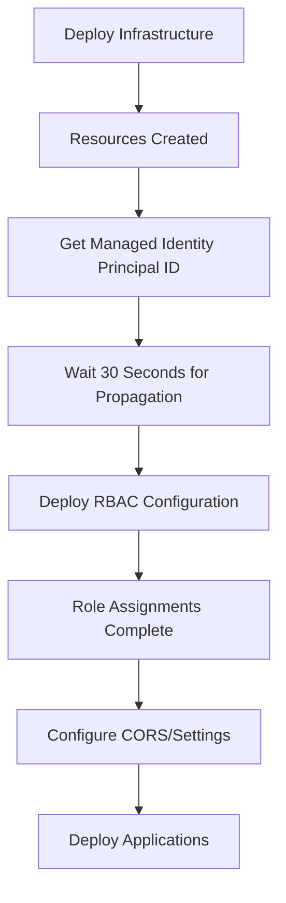

# RBAC Deployment Solution - Separate Role Assignments

## 🎯 **Problem Solved**

**Issue**: Azure Bicep deployments failing with role assignment errors, "content already consumed" errors, or timing issues when trying to assign roles to resources in the same deployment that creates them.

**Root Cause**: 
- Managed identities need time to propagate across Azure AD
- Role assignments can't be performed on resources that are still being created
- Bicep deployment conflicts when resources and role assignments are in same template

## ✅ **Solution Implemented**

### **Two-Phase Deployment Approach**

#### **Phase 1: Infrastructure Deployment** (`main.bicep`)
- Creates all Azure resources (Function App, Cosmos DB, Storage, etc.)
- Enables system-assigned managed identity on Function App
- **Does NOT perform any role assignments**

#### **Phase 2: RBAC Configuration** (`rbac.bicep`)
- Waits for identity propagation (30-second delay)
- Assigns required roles to the Function App's managed identity
- Runs as separate deployment after main infrastructure is stable

---

## 📁 **Files Added/Modified**

### **New Files**
```
infra/
├── rbac.bicep                    # 🆕 RBAC role assignments (separate deployment)
└── rbac.dev.parameters.json     # 🆕 RBAC parameters for development
```

### **Modified Files**
```
.github/workflows/ci-cd.yml      # ✏️ Added RBAC deployment step
infra/main.bicep                 # ✏️ Updated comments about RBAC approach
infra/README.md                  # ✏️ Documented new RBAC approach
```

---

## 🔧 **Technical Implementation**

### **RBAC Bicep Template** (`infra/rbac.bicep`)

**Purpose**: Assigns roles after infrastructure deployment completes

**Role Assignments**:
- **Cosmos DB Data Contributor**: Function App → Cosmos DB (full data access)
- **Storage Blob Data Contributor**: Function App → Storage Account (blob access)

**Key Features**:
- Uses `existing` resource references (no creation)
- Proper role definition IDs for built-in Azure roles
- GUID-based naming to prevent conflicts

### **CI/CD Workflow Updates**

**New Steps in Deploy Phase**:
1. **Deploy Infrastructure** (existing step)
2. **Get Resource Names and IDs** (enhanced to get Principal ID)
3. **Configure RBAC and Permissions** (🆕 new step)
4. **Configure Azure Resources** (CORS, etc.)
5. **Deploy Applications** (existing steps)

**Key Improvements**:
- **30-second wait** for identity propagation
- **Dynamic resource discovery** (no hard-coded names)
- **Graceful error handling** for RBAC failures

---

## 🎯 **Benefits**

### **Reliability**
- ✅ **No timing conflicts**: Role assignments happen after resources are fully created
- ✅ **Identity propagation**: Proper wait time for Azure AD synchronization
- ✅ **Separate failure domains**: Infrastructure vs RBAC can fail independently

### **Maintainability**
- ✅ **Clear separation**: Infrastructure vs permissions in separate files
- ✅ **Reusable**: RBAC template works for any environment
- ✅ **Debuggable**: Easy to troubleshoot role assignment issues separately

### **CI/CD Integration**
- ✅ **Automated**: Full RBAC configuration in CI/CD pipeline
- ✅ **Idempotent**: Can re-run without issues
- ✅ **Environment-aware**: Works with dev/test/prod parameters

---

## 🔍 **How It Works**

### **Deployment Flow**



### **Role Assignment Process**

1. **Infrastructure Deployment**:
   ```bash
   az deployment group create --template-file main.bicep
   # Creates: Function App with System-Assigned Identity
   ```

2. **Identity Propagation Wait**:
   ```bash
   sleep 30  # Critical for Azure AD propagation
   ```

3. **Get Principal ID**:
   ```bash
   PRINCIPAL_ID=$(az functionapp identity show --query "principalId" -o tsv)
   ```

4. **RBAC Deployment**:
   ```bash
   az deployment group create --template-file rbac.bicep \
     --parameters functionAppPrincipalId="$PRINCIPAL_ID"
   ```

---

## 🚨 **Before/After Comparison**

### **❌ Before (Problematic Approach)**
```bicep
// In main.bicep - CAUSES ISSUES
resource functionApp 'Microsoft.Web/sites@2023-12-01' = {
  // ... resource definition
  identity: { type: 'SystemAssigned' }
}

// ❌ This fails due to timing issues
resource roleAssignment 'Microsoft.Authorization/roleAssignments@2022-04-01' = {
  scope: cosmosAccount
  properties: {
    principalId: functionApp.identity.principalId  // ❌ May not be ready
    // ...
  }
}
```

### **✅ After (Solved Approach)**

**main.bicep**:
```bicep
resource functionApp 'Microsoft.Web/sites@2023-12-01' = {
  // ... resource definition
  identity: { type: 'SystemAssigned' }
}
// ✅ No role assignments here
```

**rbac.bicep** (separate deployment):
```bicep
resource functionApp 'Microsoft.Web/sites@2023-12-01' existing = {
  name: functionAppName
}

resource roleAssignment 'Microsoft.Authorization/roleAssignments@2022-04-01' = {
  scope: cosmosAccount
  properties: {
    principalId: functionAppPrincipalId  // ✅ Passed as parameter after propagation
    // ...
  }
}
```

---

## 📋 **Quick Reference**

### **Manual Deployment Commands**
```bash
# 1. Deploy infrastructure
az deployment group create --template-file infra/main.bicep --parameters @infra/main.dev.parameters.json

# 2. Wait for propagation
sleep 30

# 3. Get Principal ID
PRINCIPAL_ID=$(az functionapp identity show --name "func-member-property-alert-dev" --resource-group "rg-member-property-alert-dev" --query "principalId" -o tsv)

# 4. Deploy RBAC
az deployment group create --template-file infra/rbac.bicep --parameters environment=dev functionAppPrincipalId="$PRINCIPAL_ID" cosmosAccountName="cosmos-member-property-alert-dev" storageAccountName="stmemberpropertyalertdev123456"
```

### **Troubleshooting RBAC Issues**
```bash
# Check if managed identity exists
az functionapp identity show --name "func-member-property-alert-dev" --resource-group "rg-member-property-alert-dev"

# Check role assignments
az role assignment list --assignee "<principal-id>" --scope "/subscriptions/<sub-id>/resourceGroups/rg-member-property-alert-dev"

# Re-run RBAC deployment if needed
az deployment group create --template-file infra/rbac.bicep --parameters @parameters.json
```

---

## 🎉 **Results**

- ✅ **No more "content already consumed" errors**
- ✅ **Reliable role assignment success**
- ✅ **Clean separation of concerns**
- ✅ **Fully automated in CI/CD**
- ✅ **Environment-agnostic solution**

This solution follows Azure best practices and ensures reliable, maintainable infrastructure deployments with proper RBAC configuration.
